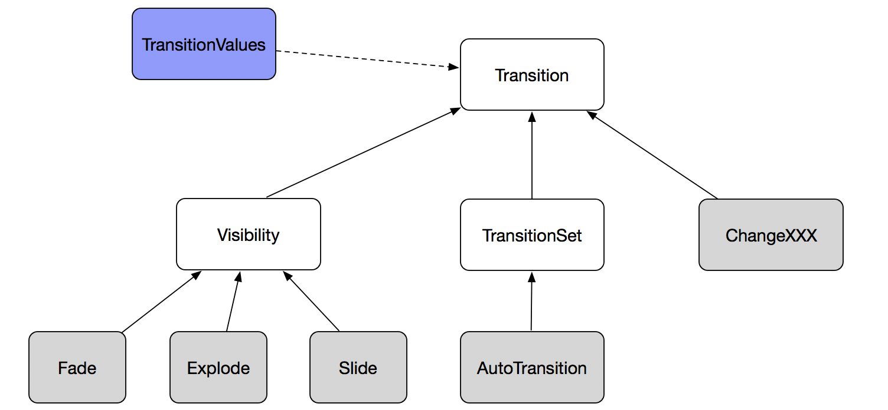
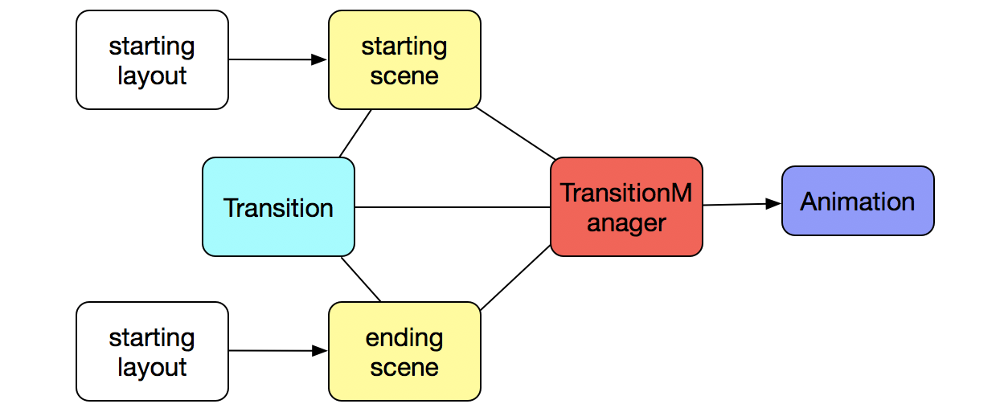
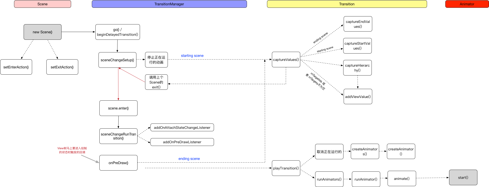

# Transition Framework

本文介绍的是android的动画框架。

## 基本介绍

Transition Framework的出现是为了更方便的触发动画，只需要提供`starting layout`和`ending layout`。同时可以指定动画的类型，比如Fade、Slide等，Transition Framework会做出从`starting layout`到`ending layout`的动画。

Transition Framework主要有3个核心的模块：

* Scene
* Transition
* TransitionManager

## Scene

Scene可以理解成场景，是静态的。它存储着View视图层级的所有状态，以及它们的属性信息。

> Scene的构造函数：

```java
public Scene(@NonNull ViewGroup sceneRoot) {
    mSceneRoot = sceneRoot;
}

public Scene(@NonNull ViewGroup sceneRoot, @NonNull View layout) {
     mSceneRoot = sceneRoot;
     mLayout = layout;
}
```

这是对外暴露的2个构造函数：

* sceneRoot：就是用来容纳转场的view的根ViewGroup
* layout：这个是具体的转场的view视图

**第一个构造函数基本没啥意义，唯一的用处可能就是用来加入enter或exit监听了。**

> Scene的其他构造：

```java
private Scene(ViewGroup sceneRoot, int layoutId, Context context) {
        mContext = context;
        mSceneRoot = sceneRoot;
        mLayoutId = layoutId;
    }
    
public static Scene getSceneForLayout(@NonNull ViewGroup sceneRoot, @LayoutRes int layoutId,
            @NonNull Context context) {
     ... ...
}
```

构造方法是私有的，外部不能调用，一般都是调用`getSceneForLayout()`方法来生成。

> enter/exit

Scene的进入和退出，这2个方法都是`TransitionManager`调用的，exit是转场请的那个Scene，先被触发；enter是转场后的那个Scene，后背触发。

```java
public void exit() {
        if (getCurrentScene(mSceneRoot) == this) {
            if (mExitAction != null) {
                mExitAction.run();
            }
        }
    }
    
public void enter() {
        // Apply layout change, if any
        if (mLayoutId > 0 || mLayout != null) {
            // empty out parent container before adding to it
            getSceneRoot().removeAllViews();

            if (mLayoutId > 0) {
                LayoutInflater.from(mContext).inflate(mLayoutId, mSceneRoot);
            } else {
                mSceneRoot.addView(mLayout);
            }
        }

        // Notify next scene that it is entering. Subclasses may override to configure scene.
        if (mEnterAction != null) {
            mEnterAction.run();
        }

        setCurrentScene(mSceneRoot, this);
    }
```

看代码，这里存在exit是在enter的时候set进去的Scene，否则就不会触发exit的runnable。

### 创建Scene

* 从layout中创建，对应`getSceneForLayout()`
* 硬代码中创建，对应`new Scene()`
* 添加enterAction/exitAction。一般的情况下，不需要定义这个action，除非：
 * 当切换的Scene不在同一个mSceneRoot层级中，这时就可以要用这个进行一些监听
 * transitions framework不能执行动画的视图，如ListView，需要自己做些处理了

## Transition

Transition是对动画的动态描述，描述了动画应该是怎样的一个方式和效果。

transition本身的结构：



下面分析下各个类的比较重要的方法：

### Transition

这是个抽象类，Transition的作用主要是保存住运行在targets上的animations信息。

#### createAnimator

```java
@Nullable
public Animator createAnimator(@NonNull ViewGroup sceneRoot,
     @Nullable TransitionValues startValues, @Nullable TransitionValues endValues) {
      return null;
}
```
这个方法其实就是来创建出实际的动画的，子类必须重写，并且这个方法只能被transition系统调用。

它有3个参数：`sceneRoot`、`startValues`、`endValues`。通过这些信息，需要建立animation对象，并且带上startValues、endValues的各自信息。

同时，transition可以确定动画是否要作用于某些view。这个主要是通过`exludeXXX()`方法来决定。

如果返回了animator，那么transition机制将装载上duration、interpolator等信息来启动动画，否则啥也不执行。

#### MatchOrder

* `MATCH_INSTANCE_STR`：instance
* `MATCH_NAME_STR`：name
* `MATCH_ID_STR`：id
* `MATCH_ITEM_ID_STR`：itemId

这个的作用就是设定动画与各个view匹配的顺序。缺省的顺序是：

```java
private static final int[] DEFAULT_MATCH_ORDER = {
      MATCH_NAME,
      MATCH_INSTANCE,
      MATCH_ID,
      MATCH_ITEM_ID,
};
```

即首先根据`View.getTransitionName()`的值来匹配，然后根据View的实例对象匹配，再是根据`View.getId()`的值来匹配，最后是列表的item id来匹配。

#### addTarget

```java
public Transition addTarget(@NonNull View target) {
   mTargets.add(target);
   return this;
}

@NonNull
    public Transition addTarget(@IdRes int targetId) {
        if (targetId != 0) {
            mTargetIds.add(targetId);
        }
        return this;
    }
    
public Transition addTarget(@NonNull String targetName) {
        if (mTargetNames == null) {
            mTargetNames = new ArrayList<>();
        }
        mTargetNames.add(targetName);
        return this;
    }
    
public Transition addTarget(@NonNull Class targetType) {
        if (mTargetTypes == null) {
            mTargetTypes = new ArrayList<>();
        }
        mTargetTypes.add(targetType);
        return this;
    }
```

**transition机制是监听sceneRoot中转场Scene下所有的view的变化**，addXXX的作用就是可以不用监听那么多，只需要监听添加上去的views，其他的直接忽略。

可以采用多种方式去添加View：

* target view本身：对应的是`mTargets`列表
* target view的id：对应的是`mTargetIds`列表
* target view的transitionName：对应的是`mTargetNames`列表
* target view的class对象：对应的是`mTargetTypes`列表

#### captureStartValues

```java
public abstract void captureStartValues(@NonNull TransitionValues transitionValues);
```

捕获start场景的动画属性值，这些值将作为startValues参数传递给createAnimator方法。

这里主要是需要指出什么样的动画properties是需要transition去关注的，同时动画properties所对应的values是什么值。

#### captureEndValues

```java
public abstract void captureEndValues(@NonNull TransitionValues transitionValues);
```

这个的作用跟上面的`captureStartValues`一样，只是作用的对象是endingScene。

#### captureValues

```java
void captureValues(ViewGroup sceneRoot, boolean start) {
	if ((mTargetIds.size() > 0 || mTargets.size() > 0)
                && (mTargetNames == null || mTargetNames.isEmpty())
                && (mTargetTypes == null || mTargetTypes.isEmpty())) {
        ... ...  // <1>
   } else {
   	     ... ...  // <2>
   }
}
```

<1> 指的就是addTarget的信息不为空的情况下，只关心这些需要关心的的views（**这里有个疑问，为啥mTargetNames和mTargetTypes必须为空，难道这里的views就不算吗？**）；<2> 则表示将遍历整个view层级来获取所有的views。

几个点：

> captureHierarchy

**Recursive method which captures values for an entire view hierarchy,starting at some root view. Transitions without targetIDs will use this method to capture values for all possible views.**

```java
private void captureHierarchy(View view, boolean start) {
	// part one 
	排除是否是需要过滤的views
	
	int id = view.getId();
        if (mTargetIdExcludes != null && mTargetIdExcludes.contains(id)) {
            return;
        }
        if (mTargetExcludes != null && mTargetExcludes.contains(view)) {
            return;
        }
        if (mTargetTypeExcludes != null) {
            int numTypes = mTargetTypeExcludes.size();
            for (int i = 0; i < numTypes; ++i) {
                if (mTargetTypeExcludes.get(i).isInstance(view)) {
                    return;
                }
            }
        }
        
    // part two
    当前view的父类是否是ViewGroup？是的话，则走进去
    主要做几个事情：
    1、触发captureStartValues/captureEndValues生成animator
    2、添加views对应的TransitionValues信息
    if (view.getParent() instanceof ViewGroup) {
            TransitionValues values = new TransitionValues();
            values.view = view;
            if (start) {
                captureStartValues(values);
            } else {
                captureEndValues(values);
            }
            values.mTargetedTransitions.add(this);
            capturePropagationValues(values);
            if (start) {
                addViewValues(mStartValues, view, values);
            } else {
                addViewValues(mEndValues, view, values);
            }
        }
        
    // part three 
    如果当前view是ViewGroup，那么将遍历所有child view
    f (view instanceof ViewGroup) {
            ViewGroup parent = (ViewGroup) view;
            for (int i = 0; i < parent.getChildCount(); ++i) {
                captureHierarchy(parent.getChildAt(i), start);
            }
        }
}
```

> addViewValues

上面的遍历整个sceneRoot，或者从执行的target views中获取需要进行动画操作的views。其目的就是将关于view的信息加入到`TransitionValuesMaps`中，具体是2个变量：

* mStartValues：staring view的TransitionValuesMaps
* mEndValues：ending view的TransitionValuesMaps

> TransitionValuesMaps

```java
class TransitionValuesMaps {

    final ArrayMap<View, TransitionValues> mViewValues = new ArrayMap<>();

    final SparseArray<View> mIdValues = new SparseArray<>();

    final LongSparseArray<View> mItemIdValues = new LongSparseArray<>();

    final ArrayMap<String, View> mNameValues = new ArrayMap<>();

}
```

可以看出，整个类其实就是很多的集合。

> playTransition

**这个是整个动画执行的入口。由TransitionManager来调用。**

核心代码：

```java
void playTransition(ViewGroup sceneRoot) {
        mStartValuesList = new ArrayList<>();
        mEndValuesList = new ArrayList<>();
        matchStartAndEnd(mStartValues, mEndValues);  // 标注1

        ArrayMap<Animator, AnimationInfo> runningAnimators = getRunningAnimators();  // 标注2
        int numOldAnims = runningAnimators.size();
        WindowIdImpl windowId = ViewUtils.getWindowId(sceneRoot);
        for (int i = numOldAnims - 1; i >= 0; i--) {
            Animator anim = runningAnimators.keyAt(i);
            if (anim != null) {
                AnimationInfo oldInfo = runningAnimators.get(anim);
                if (oldInfo != null && oldInfo.mView != null
                        && windowId.equals(oldInfo.mWindowId)) {
                    TransitionValues oldValues = oldInfo.mValues;
                    View oldView = oldInfo.mView;
                    TransitionValues startValues = getTransitionValues(oldView, true);
                    TransitionValues endValues = getMatchedTransitionValues(oldView, true);
                    boolean cancel = (startValues != null || endValues != null)
                            && oldInfo.mTransition.isTransitionRequired(oldValues, endValues);
                    if (cancel) {
                        if (anim.isRunning() || anim.isStarted()) {
                            if (DBG) {
                                Log.d(LOG_TAG, "Canceling anim " + anim);
                            }
                            anim.cancel();
                        } else {
                            if (DBG) {
                                Log.d(LOG_TAG, "removing anim from info list: " + anim);
                            }
                            runningAnimators.remove(anim);
                        }
                    }
                }
            }
        }

        createAnimators(sceneRoot, mStartValues, mEndValues, mStartValuesList, mEndValuesList);  // 标注3
        runAnimators();   // 标注4
    }
```

> 标注1

这个就是上面说的`MatchOrder`相关内容。

> 标注2

这个是用来检查是否已经有动画在运行，存在的就要把动画cancel或remove掉。

1) 获取正在运行的动画：

```java
private static ThreadLocal<ArrayMap<Animator, Transition.AnimationInfo>> sRunningAnimators = new ThreadLocal<>();

private static ArrayMap<Animator, AnimationInfo> getRunningAnimators() {
        ArrayMap<Animator, AnimationInfo> runningAnimators = sRunningAnimators.get();
        if (runningAnimators == null) {
            runningAnimators = new ArrayMap<>();
            sRunningAnimators.set(runningAnimators);
        }
        return runningAnimators;
    }
```

2) 获取该view所附着的wondow的windowId值

```java
WindowIdImpl windowId = ViewUtils.getWindowId(sceneRoot);
```

> 标注3

这里其实就是调用创建动画，设置动画的相关信息。这里会调用到上面讲的`createAnimator()`方法。

一般的继承自`Transition`类都不需要重写这个方法，除了`TransitionSet`。

> 标注4

这里就是执行动画操作。

```java
protected void runAnimators() {
        if (DBG) {
            Log.d(LOG_TAG, "runAnimators() on " + this);
        }
        start();
        ArrayMap<Animator, AnimationInfo> runningAnimators = getRunningAnimators();
        // Now start every Animator that was previously created for this transition
        for (Animator anim : mAnimators) {
            if (DBG) {
                Log.d(LOG_TAG, "  anim: " + anim);
            }
            if (runningAnimators.containsKey(anim)) {
                start();
                runAnimator(anim, runningAnimators);
            }
        }
        mAnimators.clear();
        end();
    }
```

其中`runAnimator()`才是真正的动画执行，而`start`、`end`只是listener的回调。

## TransitionManager

它是连接Scene和Transition桥梁，并且是整个Transition Framework的驱动器。

### go

```java
public static void go(@NonNull Scene scene) {
    changeScene(scene, sDefaultTransition);
}

public static void go(@NonNull Scene scene, @Nullable Transition transition) {
    changeScene(scene, transition);
}
```

### beginDelayedTransition

```java
public static void beginDelayedTransition(@NonNull final ViewGroup sceneRoot) {
    beginDelayedTransition(sceneRoot, null);
}

public static void beginDelayedTransition(@NonNull final ViewGroup sceneRoot, @Nullable Transition transition) { 
}

// 对应begin
// 强制结束所有sceneRoot下的pending/onging动画
public static void endTransitions(final ViewGroup sceneRoot) {
        sPendingTransitions.remove(sceneRoot);
        final ArrayList<Transition> runningTransitions = getRunningTransitions().get(sceneRoot);
        if (runningTransitions != null && !runningTransitions.isEmpty()) {
            // Make a copy in case this is called by an onTransitionEnd listener
            ArrayList<Transition> copy = new ArrayList<>(runningTransitions);
            for (int i = copy.size() - 1; i >= 0; i--) {
                final Transition transition = copy.get(i);
                transition.forceToEnd(sceneRoot);
            }
        }
    }
```

**go()和beginDelayedTransition()里面的代码逻辑是一样的，只是go()方法是将viewGroup组装成了Scene，而beginDelayedTransition()就直接传入的是viewGroup。**

需要关注的几个重要内部方法：

> getRunningTransitions

得到正在执行的transitions

```java
static ArrayMap<ViewGroup, ArrayList<Transition>> getRunningTransitions() {
        WeakReference<ArrayMap<ViewGroup, ArrayList<Transition>>> runningTransitions =
                sRunningTransitions.get();
        if (runningTransitions == null || runningTransitions.get() == null) {
            ArrayMap<ViewGroup, ArrayList<Transition>> transitions = new ArrayMap<>();
            runningTransitions = new WeakReference<>(transitions);
            sRunningTransitions.set(runningTransitions);
        }
        return runningTransitions.get();
    }
```

它的定义是：

```java
private static ThreadLocal<WeakReference<ArrayMap<ViewGroup, ArrayList<Transition>>>> sRunningTransitions = new ThreadLocal<>();
```

它的值是在`ViewTreeObserver.OnDrawListener`的`onPreDraw()`回调方法中。

```java
@Override
public boolean onPreDraw() {
	...
	// Add to running list, handle end to remove it
            final ArrayMap<ViewGroup, ArrayList<Transition>> runningTransitions =
                    getRunningTransitions();
            ArrayList<Transition> currentTransitions = runningTransitions.get(mSceneRoot);
            ArrayList<Transition> previousRunningTransitions = null;
            if (currentTransitions == null) {
                currentTransitions = new ArrayList<>();
                runningTransitions.put(mSceneRoot, currentTransitions);
            } else if (currentTransitions.size() > 0) {
                previousRunningTransitions = new ArrayList<>(currentTransitions);
            }
            currentTransitions.add(mTransition);
            mTransition.addListener(new TransitionListenerAdapter() {
                @Override
                public void onTransitionEnd(@NonNull Transition transition) {
                    ArrayList<Transition> currentTransitions = runningTransitions.get(mSceneRoot);
                    currentTransitions.remove(transition);
                }
            });
	...
}
```

> sceneChangeSetup

这个方法主要完成3件事情：

* 停止正在执行的动画
* 抓取需要进行动画的所有views（endingScene的）
* 如果有以前的Scene，则通知到exit回调上

> sceneChangeRunTransition

就一个目的，添加上`View.OnPreDrawListener`监听。

```java
private static void sceneChangeRunTransition(final ViewGroup sceneRoot,
            final Transition transition) {
        if (transition != null && sceneRoot != null) {
            MultiListener listener = new MultiListener(transition, sceneRoot);
            sceneRoot.addOnAttachStateChangeListener(listener);
            sceneRoot.getViewTreeObserver().addOnPreDrawListener(listener);
        }
    }
```

## 总结

所以可以总结下3者之间的关系：



更为细致的流程是：

